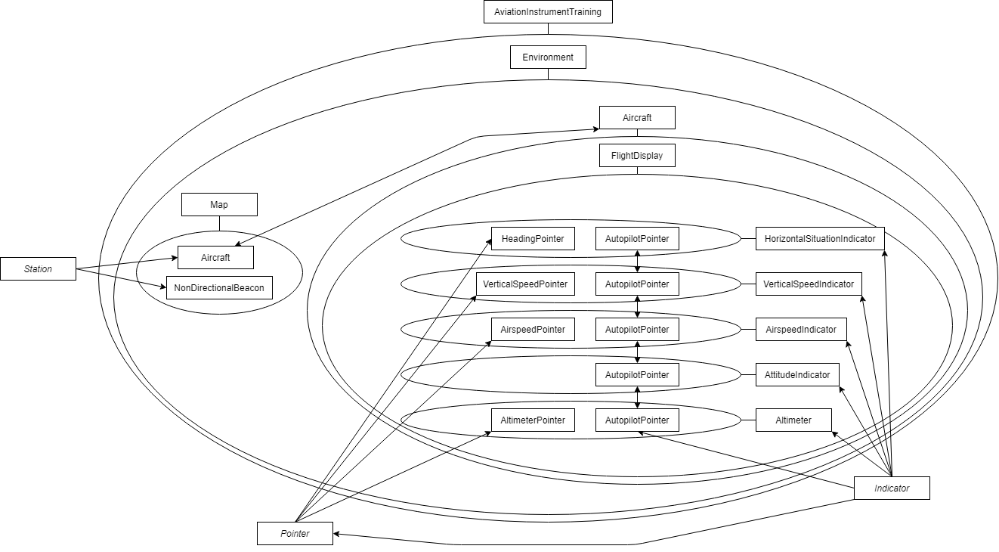

# Aviation Instrument Training

This training environment is made for pilots, who want to practise their instrument skills.

## Current state and future ideas

- [ ] Primary Flight Display (PFD)
  - [ ] Classic six indicators
    - [x] Attitude Indicator (ADI)
    - [x] Airspeed Indicator (ASI)
    - [x] Altimeter (ALTM)
    - [x] Vertical Speed Indicator (VSI)
    - [x] Horizontal Situation Indicator (HSI)
    - [ ] Slip Skid Indicator
  - [x] controllable by mouse with easy physics
- [ ] Training Environment
  - [ ] map with locations of aircraft and radio navigation systems
  - [ ] Radio Navigation Systems
    - [ ] VOR
    - [ ] NDB
- [ ] JSON implementation
  - [x] customizable layout for the whole Training Evironment
  - [x] specific values for different aircrafts
  - [x] customizable layout for the PFD
  - [ ] customizable layout for the map

Feel free to suggest further ideas by creating a [new issue](https://github.com/AronKinne/AviationInstrumentTraining/issues/new/choose).

## Controls

To control the aircraft, you have to <kbd>&#128432; click</kbd> somewhere within the bounderies of the PFD. Then, mouse control becomes active. Once active the aircraft responds to your mouse input. Move the mouse up or down to pull or push and move it to the right or left to roll in the corresponding direction. Yaw is applied automatically. The center of the input, which means the aircraft is changing whether its pitch nor its roll, is marked by the yellow reference marker. When mouse control is active you can also change the IAS of the aircraft using the mouse wheel or <kbd>&#8593;</kbd> <kbd>&#8595;</kbd>. To exit mouse control, just <kbd>&#128432; click</kbd> anywhere.

## How to use the JSON files

To improve and personalize your training you can configure the whole environment with JSON files in the directory [`data/configs`](data/configs).
Do not mess with any other files, otherwise the application might break.
In the following paragraphes you will see how to configure the environment correctly.

In some of the following JSON templates, you might find some keys, starting with `_`.
Those keys are not used, but might be helpful for comments or links.

### Environment

To configure the whole training environment, you can use [environment.json](data/configs/environment.json). This file has to follow this structure:

```json
{
  "aircraft": {
    "path": "json path to aircraft",
    "pfd": {
      "x": 0,
      "y": 0,
      "w": 0,
      "h": 0
    }
  },
  "map": {
    "bounds": {
      "x": 0,
      "y": 0,
      "w": 0,
      "h": 0
    }
  }
}
```

Explanation:

| Key                 | Description                                                                                          | Optional | Default |
| ------------------- | ---------------------------------------------------------------------------------------------------- | -------- | ------- |
| aircraft: path      | The path of the json file containing information about the used aircraft                             | no       | -       |
| aircraft: pfd: x, y | The position of the PFD                                                                              | no       | -       |
| aircraft: pfd: w, h | The size of the PFD. If `w, h <= 0`, only the other value or the default size is used for rescaling. | yes      | `0`     |
| map: bounds         | The position and size of the map                                                                     | no       | -       |

### Aircraft

Aircraft JSON files should be placed in the [`data/configs/aircraft`](data/configs/aircraft) folder.
To actually use a particular file, you have to change the path in the environment file ([see Environment](#Environment)).

To create a new aircraft, use the following template:

```JSON
{
    "name": "Aircraft name",
    "pfdlayout": "path to the used PFD layout",
    "axes": {
        "maxPitchVel": 1,
        "maxRollVel": 1,
        "maxYaw": 1
    },
    "_speeds": "(comment) can be used to store a link as reference for the values",
    "speeds": {
        "vs0": 100,
        "vs1": 150,
        "vfe": 200,
        "vno": 250,
        "vne": 300,
        "maxTurnSpeed": 1
    }
}
```

Explanation:

| Key          | Description                                                                    | Example                             | Used |
| ------------ | ------------------------------------------------------------------------------ | ----------------------------------- | ---- |
| name         | The name of the aircraft                                                       | Airbus A320, Boeing 737, Cessna 172 | no   |
| pfdlayout    | The path to the PFD layout used for this aircraft                              | `data/configs/pfdlayout/g1000.json` | yes  |
| axes         | The maximum pitch and roll speed, as well as the maximum yaw for mouse control | `0.3`, `1`, ...                     | yes  |
| speeds       | The speed values of the certain aircraft in kts                                | `87.5`, `150`, ...                  | yes  |
| maxTurnSpeed | The maximum turn speed of the aircraft                                         | `0.5`, `2`, ...                     | yes  |

### PFD Layout

Those files are used to customize the layout of the PFD.
Place a new file in the folder [`data/configs/pfdlayout`](data/configs/pfdlayout).
To use a layout for a certain aircraft, put the path of the layout file in the JSON file of the aircraft ([see Aircraft](#Aircraft)).

The most values in this file are position or size values.
Every value is relative to its parents position.
The position values are always the location of the top-left corner.
To get the values, I suggest to find an appropriate image of the PFD and to use it with an [online ruler tool](https://www.rapidtables.com/web/tools/pixel-ruler.html).
Then you can input every value as integer or floating point number.

To create a new PFD layout, use the following template:

```JSON
{
    "name": "Layout name",
    "_img": "(comment) can be used to store the link of an image, which was used with ruler",
    "layout": {
        "width": 0,
        "height": 0,
        "background": [0, 0, 0, 0],
        "adi": {
            "x": 0,
            "y": 0,
            "width": 0,
            "height": 0,
            "pivotX": 0,
            "pivotY": 0,
            "degInPx": 0
        },
        "asi": {
            "x": 0,
            "y": 0,
            "width": 0,
            "height": 0,
            "pointerY": 0,
            "numberStep": 0,
            "ktInPx": 0
        },
        "altm": {
            "x": 0,
            "y": 0,
            "width": 0,
            "height": 0,
            "pointerY": 0,
            "ftInPx": 0
        },
        "vsi": {
            "x": 0,
            "y": 0,
            "width": 0,
            "height": 0,
            "pointerW": 0,
            "fpmInPx": 0
        },
        "hsi": {
            "x": 0,
            "y": 0,
            "d": 0,
            "bigLineWidth": 0,
            "numberStep": 0
        }
    }
}
```

Explanation:

| Key                                   | Description                                                                                                     | Optional | Default                             |
| ------------------------------------- | --------------------------------------------------------------------------------------------------------------- | -------- | ----------------------------------- |
| name                                  | The name of the layout                                                                                          | yes      | -                                   |
| width, height                         | The size of the PFD                                                                                             | no       | -                                   |
| background                            | The background color, which might be visible. Format: `[R, G, B, ALPHA]`. Every value ranges from `0` to `255`. | yes      | `[0, 0, 0, 255]`                    |
| adi: x, y, width, height              | The position and size of the ADI                                                                                | yes      | `0, 0, layout width, layout height` |
| adi: pivotX, pivotY                   | The position of the center point of the ADI                                                                     | no       | -                                   |
| adi: degInPx                          | Used for the scala. `1 degree = <degInPx> pixels`                                                               | no       | -                                   |
| other indicators: x, y, width, height | The position and size of the indicator                                                                          | no       | -                                   |
| asi and altm: pointerY                | The y-position of the pointer                                                                                   | no       | -                                   |
| asi: numberStep                       | The step size of the numbers on the scala                                                                       | yes      | `10`                                |
| asi: ktInPx                           | Used for the scala. `1 knot = <ktInPx> pixels`                                                                  | no       | -                                   |
| altm: ftInPx                          | Used for the scala. `1 foot = <ftInPx> pixels`                                                                  | no       | -                                   |
| vsi: pointerW                         | The width of the pointer                                                                                        | no       | -                                   |
| vsi: fpmInPx                          | Used for the scala. `1 foot per minute = <fpmInPx> pixels`                                                      | no       | -                                   |
| hsi: d                                | The diameter of the HSI                                                                                         | no       | -                                   |
| hsi: bigLineWidth                     | The width of one of the big lines on the scala of the HSI                                                       | no       | -                                   |
| hsi: numberStep                       | The step size of the numbers of the scala                                                                       | yes      | `30`                                |

A graphical explanation might follow soon.

## Installation

If you want to use this code you need [Processing 3](https://processing.org/). Just download this project and open it in Processing. Click the play button to start the application.

## Class diagram for the poor



## Credits

[Aircraft icon](data/resources/aircraft.svg): Icon made from [Icon Fonts](http://www.onlinewebfonts.com/icon) is licensed by CC BY 3.0

## License

This project is licensed under the MIT License - see the [LICENSE.md](LICENSE.md) file for details
